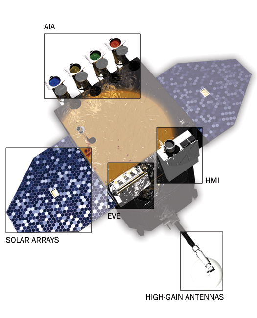

# Tutorial Session for SPCE0011 2025/2026: Imaging the Solar Surface

This repository hosts data and code for the Solar Physics Course tutorial sessions at UCL, Academic Year 2025/2026. 
Specifically aims to help students better understand the python packages used to download and view observations of the Sun from various Solar observatories.

To run these notebooks, simply click the "Open in Colab" banner, you will need a Google account for this. It will redirect you to Google Colab, which allows you to run Python without installing it on your computer. Once you are in Colab, feel free to edit or play around the code as much as you like. The original code won't be affected.

Content
- Loading and reading data from SDO/AIA and SDO/HMI
- Understanding the python packages needed to process and view AIA and HMI images.
- Plotting solar images and identifying features in the different layers of the solar atmosphere.

Check out the cool Python libraries used in this project
- sunpy (analysing any solar stuff): [https://sunpy.org]
- aiapy (analysing data from SDO/AIA): [https://aiapy.readthedocs.io/en/stable/index.html]
